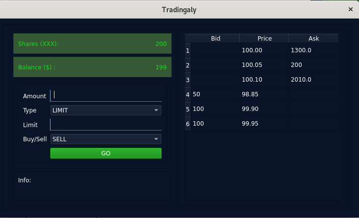

# Tradingaly : Basic trading account simulator

## A Python project for executing sell and buy orders to a local trading account.

This project is intended to help practicing Buy and Sell orders on a market  
by simulating a basic trading account and a local sandbox orderbook and a market.

## Features

* Selling shares available in the user portfolio.
* Buying shares available on the "market". The market has only 1 share available for now.
* Visualizing shares hold by user as well as the amount of liquidity on the user account.
* Visualizing the amount of shares available on the market and the associated ASK and BID.offers.



## How to use it?

1. Clone the repo on your local machine.
3. Type the command:  

```shell
  python3 run.py
```

## Find a bug or want to improve?

If you found an issue or would like to submit an improvement to this project,   
please submit an issue using the issue tab above.  
If you would like to submit PR with a fix, reference the issue you created.  

## Known issues (Work in progress)

Limit orders are not working.
